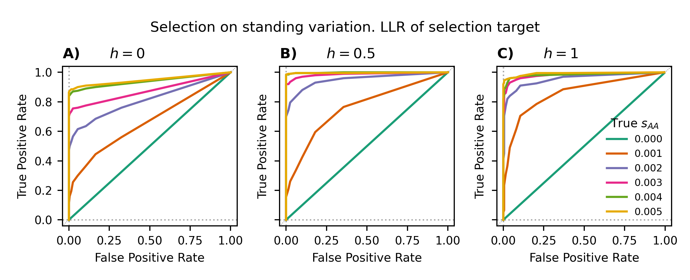
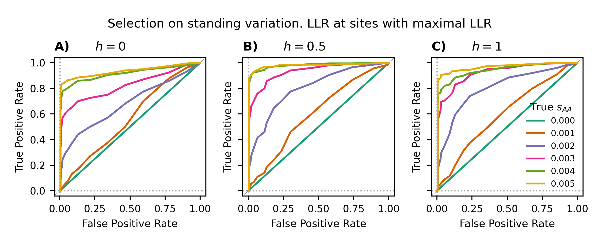
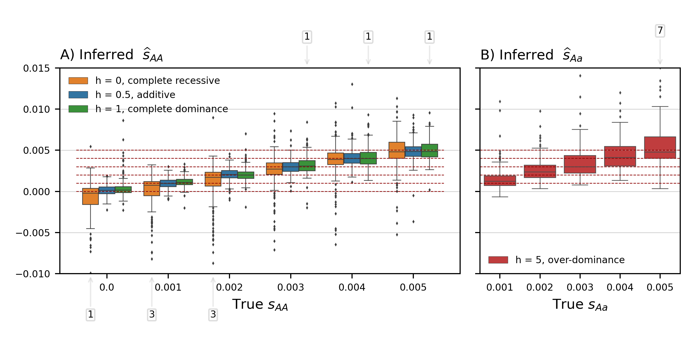
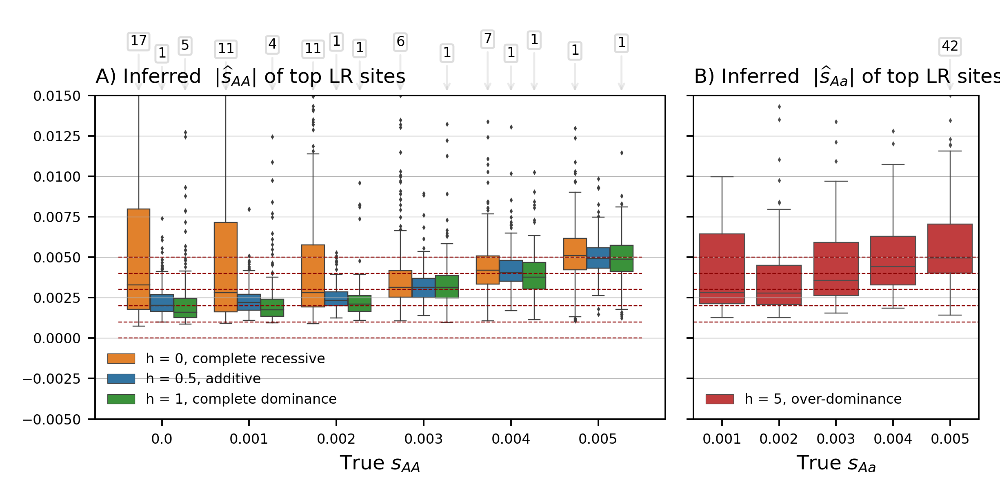
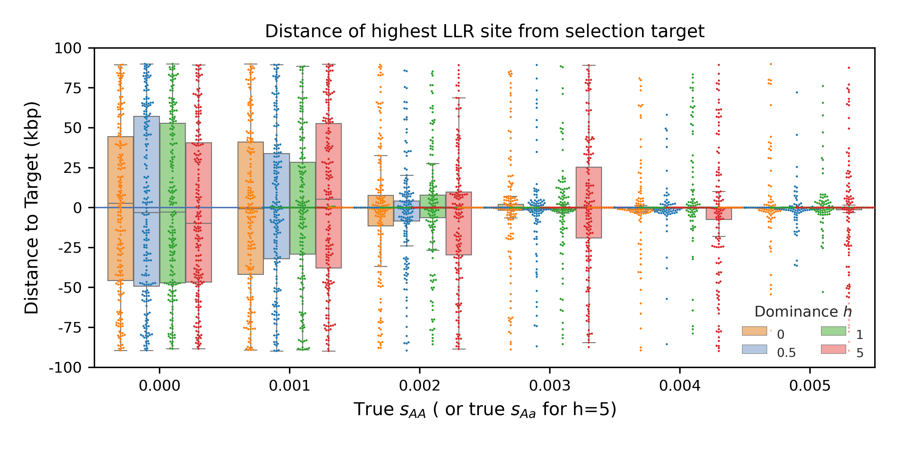

# Figures for _"`diplo-locus`: A lightweight toolkit for inference and simulation of time-series genetic data under general diploid selection"_

This repository contains replicable scripts for generating simulations and replicating figures as shown in the manuscript.

To cite our application, use the reference:

>   Cheng, X. and Steinruecken, M. (2023) diplo-locus: A lightweight toolkit for inference and simulation of time-series genetic data under general diploid selection. bioarxiv: https://doi.org/10.1101/2023.10.12.562101

------------------
## Set up

In order for scripts in this repository to run, the Python version must be at least 3.8. The user must also have the [`diplo_locus` package installed](https://github.com/steinrue/diplo_locus/). Both the API and CLI will be used.

Download this repository with
```shell
# download
git clone --recurse-submodules https://github.com/steinrue/diplo_locus_manuscript_figs
# enter the dir
cd diplo_locus_manuscript_figs
```

All scripts in the instructions below are used only in Unix command-line interface.


<a id="toc"> </a>

## Table of Contents

 * [Fig. S1 - S7: Data simulation and likelihood-based inference using `diplo_locus` package](#DLsim)
 * [Fig. S8 - S12: `DiploLocus` Likelihood-based inference on `SLiM` simulations](#Slim)
 * [Fig. S13 - S14: Examining genotype data around *LCT* gene in UK population from AADR database](#LCT)
 * [Fig. 1 in main text: Combination of previous figures](#main_fig)


## _Part 1_ (Fig. S1 - S7): Data simulation and likelihood-based inference using `diplo_locus` Python package
<a id="DLsim"> </a>

Navigate to the folder and create a folder to keep all the simulated data:
```shell
# navigate to the dir
cd figS1-S7_DLsims/
# create folder for simulated data
mkdir simulations/
```

### 1.1 Data generation
To simulate replicates and compute their likelihoods, run
```shell
# Run analysis with variable s_AA: 
## Simulations initiated with a Watterson's standard neutral
## Usage: 
## python step1_DL_sim2mlr_stdVar.py <outprefix> <nuet_samples_pkl> <init_distn> <minMAF> [seed]
python step1_DL_sim2mlr_stdVar.py simulations/varS2 "none_yet" initDistn_watterson-N1e4.txt 0.05 87235

## Likewise, to simulate data from initial frequency of 0.01:
## Usage:
## python step1_DL_sim2mlr_initFreq.py <outprefix> <neut_samples_pkl> <minMAF> [seed]
python step1_DL_sim2mlr_initFreq.py simulations/varS2 "none_yet" 0.05 10827

# Run analyses with variable S_aA:
## Usage:
## python step1_DL_sim2mlr_s1-var.py <outprefix> <neut_samples_pkl> <init_distn> <minMAF> [seed]
python step1_DL_sim2mlr_s1-var.py simulations/varS1 "none_yet" initDistn_watterson-1Ne4.txt 0.05 9567 
```

For scenarios with variable true $s_\text{AA}$ (i.e. `s2`), with either type of simulation initial condition, 4 values for the dominance coefficient `h`, $h \in \{0, 0.5, 1, 5\}$, and 7 values for the selection coefficient `s2`, $s_\text{AA} \in \{0, 0.001, 0.002, 0.003, 0.004, 0.005, 0.01, 0.02\}$ are analyzed.

For scenarios with variable true $s_\text{Aa}$ (i.e. `s1`), with either type of simulation initial condition, 2 values for the dominance coefficient `h`, $h \in \{5, \infty\}$ (in the $h=\infty$, it's equivalent to setting `s2=0` with the given `s1` value), and 7 values for the selection coefficient `s1`, $s_\text{AA} \in \{0.001, 0.002, 0.003, 0.004, 0.005, 0.01, 0.02\}$ are analyzed.

 For each combination of parameters, 500 replicates are generated, conditioning on each replicate's...
* population allele frequency never falls below $1/(4N_e)$ (equivalent to allele not being lost), and
* pooled minor sample allele frequency be greater than 0.05.

When computing likelihood surface, a symmetrical geometric grid (including zero) of $s$ values is adopted. The user can obtain the same grid with the following codes in an interactive python session:
```python
>>> import numpy as np
>>> from diplo_locus.utility import _get_geom_grid
>>> s_grid = _get_geom_grid(-0.75, 0.75, 50, Ne=1e4)
>>> s_grid
# array([-7.50000000e-01, -5.10969052e-01, -3.48119163e-01, -2.37170825e-01,
#        -1.61582602e-01, -1.10084945e-01, -7.50000000e-02, -5.10969052e-02,
#        -3.48119163e-02, -2.37170825e-02, -1.61582602e-02, -1.10084945e-02,
#        -7.50000000e-03, -5.10969052e-03, -3.48119163e-03, -2.37170825e-03,
#        -1.61582602e-03, -1.10084945e-03, -7.50000000e-04, -5.10969052e-04,
#        -3.48119163e-04, -2.37170825e-04, -1.61582602e-04, -1.10084945e-04,
#        -7.50000000e-05,  0.00000000e+00,  7.50000000e-05,  1.10084945e-04,
#         1.61582602e-04,  2.37170825e-04,  3.48119163e-04,  5.10969052e-04,
#         7.50000000e-04,  1.10084945e-03,  1.61582602e-03,  2.37170825e-03,
#         3.48119163e-03,  5.10969052e-03,  7.50000000e-03,  1.10084945e-02,
#         1.61582602e-02,  2.37170825e-02,  3.48119163e-02,  5.10969052e-02,
#         7.50000000e-02,  1.10084945e-01,  1.61582602e-01,  2.37170825e-01,
#         3.48119163e-01,  5.10969052e-01,  7.50000000e-01])
```

The parameter settings described above are hard-coded in the python scripts. To consider other alternatives, the user should modify the codes at their own discretion.

With the hard-coded parameters, it takes ~4.5 core hours (on HPC) to generate either of the `varS2` simulations, and ~2.5 hours for `varS1` simulations. The `.pkl` files generated from these pipelines take about ~9 Gb space.


### 1.2 Plotting

#### 1.2.1 Receiver Operating Characteristic (ROC) curves (Fig. S1 - S3)
To visualize the simulated data as shown in the manuscript, run
```shell
# plot ROC from the off-grid max-likelihood likelihood ratios
## Usage:
## python plot_DLsim_ROCs.py <generic_s2_pkl> <generic_s1_pkl> <sim_init> <fig_prefix>
### generic names of .pkl files that contain the likelihood computation results. Use the "\*" wildcard character(s) to match all files
s2_pkl_name="simulations/varS2_fromSeed87235_simInitSV_h\*LLinit\*_offGridMLE.pkl" 
s1_pkl_name="simulations/varS1_fromSeed9567_simInitSV_simH\*LLinit\*_offGridMLE.pkl" 
### prefix of the ROC figure
roc_prefix="simInitSV_s2-87235_s1-9527"
# now plot
python step2_plot_DLsim_ROCs.py ${s2_pkl_name} ${s1_pkl_name} "Watterson neutral" ${roc_prefix} 
```
The commands above will generate multi-panel ROC curves for simulations initiated with the given distribution.


Likewise, ROCs for simulations with the fixed initial frequency of 0.01 can be generated using the same script:
```shell
# plot ROC from the off-grid max-likelihood likelihood ratios
### generic name of .pkl files that contain the likelihood computation results. Use the "\*" wildcard character(s) to match all files
s2_pkl_name="simulations/varS2_fromSeed10827_simInitFreq.01_h\*LLinit\*_offGridMLE.pkl" 
s1_pkl_name="simulations/varS1_fromSeed9567_simInitFreq.01_simH\*LLinit\*_offGridMLE.pkl" 
### prefix of the ROC figure
roc_prefix="simInitFreq.01_s2-10827_s1-9527"
# now plot
python step2_plot_DLsim_ROCs.py ${s2_pkl_name} ${s1_pkl_name} "initial freq f=0.01" ${roc_prefix} 
```


([Back to TOC](#toc))

#### 1.2.2 Quantile-quantile plots (QQ-plots) for the distributions of likelihood ratio test statistics (Fig. S4)

To generate QQ-plots as shown in the supplement, run the script `step2_plot_DLsim_QQplot.py` on data generated in the previous step, specifically focus on the case of semi-dominance ($h=0.5$, _i.e._ additive):

```shell
# Collect simulation pkls, compare quantiles of LLRs against standard chi-square (df=1)
### simulations initiated with standing variation (SV):
freq_pkl_name="simulations/varS2_fromSeed10827_simInitFreq.01_h\*LLinit\*_offGridMLE.pkl" 
### simulations initiated with  fixed frequency (Freq.01):
sv_pkl_name="simulations/varS2_fromSeed87235_simInitSV_h\*LLinit\*_offGridMLE.pkl" 
### name of qqplot
fig_name="QQplot_fixH.5_3initCombos_freq10827-sv87235.png"
## Usage:
## python %prog <freq_pkl> <sv_pkl> <fig_name>
python step2_plot_DLsim_QQplot.py ${freq_pkl_name} ${sv_pkl_name} ${fig_name}
```


#### 1.2.3 Boxplots for max-likelihood estimates (MLEs) (Fig. S5 - S7)

The plotting script `step2_plot_DLsim_contrastBoxes.py` has the same usage as `step2_plot_DLsiims_ROCs.py`.

In addition to two plots---one for either initial condition adopted in likelihood computation---it will also produce two tables with outlier replicates whose MLEs fall outside the range covered by the y-axes in the plot (that is, $[-0.01, 0.015]$).

```shell
# plot boxplots for MLEs
## simulations initiated with standing variation (SV):
s2_pkl_name="simulations/varS2_fromSeed87235_simInitSV_h\*LLinit\*_offGridMLE.pkl" 
s1_pkl_name="simulations/varS1_fromSeed9567_simInitSV_simH\*LLinit\*_offGridMLE.pkl" 
### prefix of the figure
prefix="simInitSV_s2-87235_s1-9527"
# now plot
python step2_plot_DLsim_contrastBoxes.py ${s2_pkl_name} ${s1_pkl_name} "Watterson neutral" ${prefix} 

## simulations initiated with fixed frequency (Freq.01):
s2_pkl_name="simulations/varS2_fromSeed10827_simInitFreq.01_h\*LLinit\*_offGridMLE.pkl" 
### $s1_pkl_name stays the same
prefix="simInitFreq.01_s2-10827_s1-9527"
# now plot
python step2_plot_DLsim_contrastBoxes.py ${s2_pkl_name} ${s1_pkl_name} "initial freq 0.01" ${prefix} 
```


([Back to TOC](#toc))

## _Part 2_ (Fig. S8 - S12): `DiploLocus` likelihood-based inference on `SLiM` simulations
<a id="Slim"> </a>

Simulations and analyses in this section were performed on high-performance computing (HPC) clusters managed by SLURM system, so the steps below for replication also leverage such a system. While it is possible for one to modify the scripts to run on a local PC, it is not recommended due to the large amount of computing time needed. 

Before starting, the user must [install `SLiM 4`]() such that the software could be run with the command `slim`.  In their Python environment, the user must also install `pyslim`, `msprime`, and `tskit` packages, in addition to the ones required by `diplo-locus`.

To start from the root directory, navigate to the directory:
```shell
# navigate to the dir
cd figS8-S12_SLiM/
```

The python script `run_MSinit_slim_reps_SV.py` will simulate a designated pool of replicates by the procedures described in Section S3.1 in the _Supplementary Note_. It will follow the seeds for each replicate as specified in `slim4_input/` for given scenarios, which are identical to the ones used in our study.

The script `parseSlim4_TrackSel_var-t.py` will parse the SLiM output generated by each replicate simulation into an allele count table of all segregating variants on the simulated sequence. 

Both python scripts above will be called by `step1_sim-pipeline.sh`. This bash script includes both the simulation pipeline (simulate + analyses by `DiploLocus`) and batch job parameters for SLURM.

### 2.1 Data generation on SLURM-managed HPC clusters

We simulate 200 replicates for each combination of selection parameters (selection coefficient of homozygotes $s$, and dominance coefficient $h$). For $s \in {0, 0.001, 0.002, 0.003, 0.004, 0.005}$ and $h \in {0, 0.5, 1}$, with the exception of $s=0$, there are 16 scenarios in total to simulate. For $h=5$, there are $s = 0.0002, 0.0004, 0.0006, 0.0008, 0.001$, *i.e.* five scenarios, to simulate. These 21 scenarios corresponds to the 21 files in `slim4_input/` that record the seeds.

To simulate each scenario, denote its selection parameters as `var_s` (only include digits following the decimal point) and `var_h`. Depending on how the user chooses to parallelize the simulation, use `M` to denote the number of replicates (out of the total 200) to simulate in each array job, then the `sbatch` command to submit the batch jobs can be:

```shell
# Submit batch array jobs to simulate 200 replicate for each scenario
## Determine the number of array jobs needed:
n_parts=$( expr 200 / $M )

## Submit job to run neutral simulation
sbatch -J neut.${M}x --export frac_s=0,h=0.5,part=$M \ 
       --array=0-$( expr ${n_parts} - 1 ) step1_sim_pipeline.sh

## simulations with h <= 1
for var_h in {0,0.5,1}; do
  for var_s in {001,002,003,004,005}; do
    echo "simulating s = 0.${var_s} , h = ${var_h} in ${n_parts} array jobs"
    sbatch -J s${var_s}h${var_h}.${M}x \
           --export frac_s=${var_s},h=${var_h},part=$M \ 
           --array=0-$( expr ${n_parts} - 1 ) step1_sim_pipeline.sh
  done
done

## simulations with h = 5
for var_s in {0002,0004,0006,0008,001}; do
echo "simulating s = 0.${var_s} , h = 5 in ${n_parts} array jobs"
sbatch -J ${JobName}_s${var_s}h5.${M}x \
       --export frac_s=${var_s},h=5,part=$M \ 
       --array=0-$( expr ${n_parts} - 1 ) step1_sim_pipeline.sh
done
```

Alternatively, the user can refer to commands in the `step1_sim_pipeline.sh` script to replicate our simulation in non-HPC environments.


### 2.2 Data summary

To collect computed likelihoods for all simulated data, use commands:

```shell
# Usage:
# python %prog <minMAF> <name_prefix> [s1]
## collect h <= 1:
python step2_filter_n_summarize_Slim.py 0.05 DL 
## collect h > 1:
python step2_filter_n_summarize_Slim.py 0.05 DL s1
```

The `step2_filter_n_summarize_Slim.py` script will generate two tables in `.tsv.gz` format, respectively recording the parameters, position, and likelihood statistics (LL, LLR, MLE) of **i)** selection target sites, and **ii)** sites with sequence-wise highest LLR of each replicate across all simulated scenarios. It will also generate two `.tsv` tables under each scenario folder summarizing replicates in this same scenario. 

With the above commands, the user would expect output tables `DL-varS2_selected-sites_minMAF.05_200kb_t9x500gen_n40_3h6s_Concatenated_offGrid_Dist.tsv.gz`, `DL-varS2_maxLR-sites_minMAF.05_200kb_t9x500gen_n40_3h6s_Concatenated_offGrid_Dist.tsv.gz`, `DL-varS1_selected-sites_minMAF.05_200kb_t9x500gen_n40_2h6s_Concatenated_offGrid_Dist.tsv.gz`, and `DL-varS1_maxLR-sites_minMAF.05_200kb_t9x500gen_n40_2h6s_Concatenated_offGrid_Dist.tsv.gz`.


### 2.3 Plotting

The python scripts with their file names leading by `step3_` are all used to generate plot based on the tables generated in the previous step.

```shell
# Plot SLiM simulation results
## save the filenames for convenience
tsv_s2_target="DL-varS2_selected-sites_minMAF.05_200kb_t9x500gen_n40_3h6s_Concatenated_offGrid_Dist.tsv.gz"
tsv_s2_maxLR="DL-varS2_maxLR-sites_minMAF.05_200kb_t9x500gen_n40_3h6s_Concatenated_offGrid_Dist.tsv.gz"
tsv_s1_target="DL-varS1_selected-sites_minMAF.05_200kb_t9x500gen_n40_2h6s_Concatenated_offGrid_Dist.tsv.gz"
tsv_s1_maxLR="DL-varS1_maxLR-sites_minMAF.05_200kb_t9x500gen_n40_2h6s_Concatenated_offGrid_Dist.tsv.gz"

## Plot ROCs: (Fig. S8, S11)
## Usage:
## python step3_plot_Slim_ROCs_fromTSV.py <s1_scores> <s2_scores> <name_prefix>
### Fig. S8, target sites
python step3_plot_Slim_ROCs_fromTSV.py ${tsv_s2_maxLR} ${tsv_s2_target} target-sites
### Fig. S11, maxLR sites
python step3_plot_Slim_ROCs_fromTSV.py ${tsv_s2_maxLR} ${tsv_s2_target} maxLR-sites
```





```shell
## Plot boxplots of MLEs: (Fig. S9, S12)
## Usage:
## python step3_plot_Slim_contrastMLEs_fromTSV.py <s1_scores> <s2_scores> 
### Fig. S9, target sites
python step3_plot_Slim_contrastMLEs_fromTSV.py ${tsv_s2_maxLR} ${tsv_s2_target} target-sites
### Fig. S12, maxLR sites
python step3_plot_Slim_contrastMLEs_fromTSV.py ${tsv_s2_maxLR} ${tsv_s2_target} maxLR-sites
```





```shell
## Plot distance to true target: (Fig. S10)
## Usage:
## python step3_plot_Slim_pos_dist.py <figname_prefix> <sel_score_s2> <max_score_s2> <sel_score_s1> <max_score_s1> 
python step3_plot_Slim_pos_dist.py SLiM ${tsv_s2_target} ${tsv_s2_maxLR} ${tsv_s1_target} ${tsv_s1_maxLR}
```




([Back to TOC](#toc))

## _Part 3_ (Fig. S13 - S14): Examining genotype data around *LCT* gene in UK population from AADR database
<a id="LCT"> </a>

### 3.1 Data download and parsing

Data for this example is extracted from [Allen Acient DNA Resources databse v54.1](https://reich.hms.harvard.edu/allen-ancient-dna-resource-aadr-downloadable-genotypes-present-day-and-ancient-dna-data).
```shell
# Move to the corresponding folder (assume one starts at SLiM folders)
cd ../figS13-S14_LCT/

# Download dataset
## This step might take a while depending on the internet bandwidth
##  the tarball `v54.1_1240K_public.tar` takes ~5 Gb disk space.
mkdir v54.1_1240K
cd v54.1_1240K
wget https://reichdata.hms.harvard.edu/pub/datasets/amh_repo/curated_releases/V54/V54.1/SHARE/public.dir/v54.1_1240K_public.tar 
# Decompress the tarball
tar -xvf v54.1_1240K_public.tar
# check files
ls ./
#v54.1_1240K_public.anno  v54.1_1240K_public.ind  v54.1_1240K_public.tar
#v54.1_1240K_public.geno  v54.1_1240K_public.snp
## Return to the main folder
cd ../ 
```
The extracted files from this tarball are in EIGENSTRAT format and contain data for all genomes from published ancient DNA studies. To make subsequent file-handling easier, we first generate a subset of all UK samples for VCF conversion:
```shell
# create the folder to store vcfs
mkdir extracted/
# run script
python extractIDsFromAnnoUK.py
```
This step will generate `extracted/UK_v54.1_all_with_duplicates.table`, which will be used to make VCFs later.

To this end, we use a tool from the [gdc](https://github.com/mathii/gdc) package to convert EIGENSTRAT-formatted data to VCF format. This step could be done with the following commands:

```shell
# make sure the submodule folder isn't empty:
git submodule update --recursive

# convert eigenstrat to vcf:
## here we're only interested in chromosome 2, where LCT gene sits
python extractUKTimeSeries_byChr.py 2
```
The converted VCF file will be `extracted/UK_v54.1_all_with_duplicates_c2.vcf`.

### 3.2 Filtering data by sample and SNP info

Next, the script `filter_v54_vcfs.py` can be used to further narrow down the individuals and SNPs to be included in the `DiploLocus` input.
```shell
python filter_v54_vcfs.py
# usage: filter_v54_vcfs.py [-h] --vcf VCFFILE --anno ANNOFILE [--gen_time GEN_TIME] [--out OUTPREFIX] [--writeVCF]
#                           [--writeCounts | --no-writeCounts | --outputCounts | --no-outputCounts] [--ID_col IDCOLNAME]
#                           [--time_ago_col TIMEAGOCOLNAME] [--inds INDS] [--country WHERE]
#                           [--SG | --no-SG | --Shotgun | --no-Shotgun] [--DG | --no-DG | --Diploid | --no-Diploid]
#                           [--1240K_only | --no-1240K_only | --1240k_only | --no-1240k_only]
#                           [--PASS {none,loose,strict}] [--Fam | --no-Fam] [--Modern | --no-Modern]
#                           [--fromYBP FROM_YEAR] [--toYBP TO_YEAR] [--force_hap FORCED_HAPS] [--force_dip FORCED_DIPS]
#                           [--snps SNPS] [--chr CHROM] [--pos POSRANGE]
#                           [--max_missing MAXMISSING | --min_observed MINOBS] [--minK MINK] [--minMAF MINMAF]
# filter_v54_vcfs.py: error: the following arguments are required: --vcf, --anno
```

One can also see the full help page with `-h` or `--help` flag.

<details>
<summary>Click here to read the full help page.</summary>

```shell
python filter_v54_vcfs.py -h
# usage: filter_v54_vcfs.py [-h] --vcf VCFFILE --anno ANNOFILE [--gen_time GEN_TIME] [--out OUTPREFIX] [--writeVCF]
#                           [--writeCounts | --no-writeCounts | --outputCounts | --no-outputCounts] [--ID_col IDCOLNAME]
#                           [--time_ago_col TIMEAGOCOLNAME] [--inds INDS] [--country WHERE]
#                           [--SG | --no-SG | --Shotgun | --no-Shotgun] [--DG | --no-DG | --Diploid | --no-Diploid]
#                           [--1240K_only | --no-1240K_only | --1240k_only | --no-1240k_only]
#                           [--PASS {none,loose,strict}] [--Fam | --no-Fam] [--Modern | --no-Modern]
#                           [--fromYBP FROM_YEAR] [--toYBP TO_YEAR] [--force_hap FORCED_HAPS] [--force_dip FORCED_DIPS]
#                           [--snps SNPS] [--chr CHROM] [--pos POSRANGE]
#                           [--max_missing MAXMISSING | --min_observed MINOBS] [--minK MINK] [--minMAF MINMAF]

# optional arguments:
#   -h, --help            show this help message and exit

# Input:
#   --vcf VCFFILE         VCF files to be parsed.
#   --anno ANNOFILE       ".anno" file as presented in the v54.1 1240K database.
#   --gen_time GEN_TIME   Average generation time, in years, to be used for converting years to generations.Default
#                         value is 26.9 years (Wang et al. 2023; https://doi.org/10.1126/sciadv.abm7047)

# Output Options:
#   --out OUTPREFIX, -o OUTPREFIX, --outname OUTPREFIX
#                         path and prefix to output files.
#   --writeVCF, --outputVCF
#                         Option to write out the filtered VCF file. Default is False.
#   --writeCounts, --no-writeCounts, --outputCounts, --no-outputCounts
#                         Choose whether the allele count file will be written. (default: True)

# Sample-based Filters:
#   --ID_col IDCOLNAME    Name of the column in info table for ID names of the sample (as shown in VCF). Default is
#                         "ID".
#   --time_ago_col TIMEAGOCOLNAME
#                         Name of the column in info table for each sample's sampling times (backward; ascending from
#                         present to past). Default name is "MeanYBP", unit is years before present (:=1950).
#   --inds INDS           List (or file name) of sample IDs to include. Default is to include all samples shared between
#                         vcf & info files.
#   --country WHERE, --place WHERE, --locality WHERE, --region WHERE
#                         Key word in "Political Entity" or "Locality" column in the .anno file.
#   --SG, --no-SG, --Shotgun, --no-Shotgun
#                         Option to include ("True") or exclude ("False") shotgun-sequenced samples, as indicated in the
#                         "Data source" column. Default is to ignore such info.
#   --DG, --no-DG, --Diploid, --no-Diploid
#                         Option to include ("True") or exclude ("False") samples with diploid variant calls, as
#                         indicated in the "Data source" column. Default is to ignore such info.
#   --1240K_only, --no-1240K_only, --1240k_only, --no-1240k_only
#                         Option to only include samples sequenced via 1240K captures. That is, "Data source"_is
#                         exactly_ "1240[K|k]".
#   --PASS {none,loose,strict}
#                         Options on the requirement for quality filters."none": ignore such info; "loose" (default):
#                         samples whose "Assessment" column _contains_ "PASS"; "strict": samples whose "Assessment"
#                         column _is exactly_ "PASS".
#   --Fam, --no-Fam       Option to include ("True") or exclude ("False") samples with known relatives recorded, as
#                         indicated in the "Family ID" column. Default is to ignore such info.
#   --Modern, --no-Modern
#                         Option to include ("True") or exclude ("False") samples with known relatives recorded, as
#                         indicated in the "Family ID" column. Default is to ignore such info.
#   --fromYBP FROM_YEAR, --from FROM_YEAR, --sinceYBP FROM_YEAR, --since FROM_YEAR
#                         The oldest time (including itself), in years before present, based on the sample's mean
#                         calibrated YBP, to consider. Default is to take all.
#   --toYBP TO_YEAR, --to TO_YEAR
#                         The latest time (excluding itself), in years before present, based on the sample's mean
#                         calibrated YBP, to consider. Default is to take all.

# VCF-based Filters:
#   --force_hap FORCED_HAPS
#                         Comma-separated string or a plain-text file that lists IDs (matching VCF column names) to be
#                         considered as haploids even though some may present diploid genotype calls. If "all", all
#                         samples will be considered as haploids, whose genotypes will be counted as matching haplotype
#                         (i.e. half the alleles). Force quit if any specified individual has heterozygote variant or
#                         any unmentioned diploid-formatted samples lack heterozygote variant calls. Default is "none".
#   --force_dip FORCED_DIPS
#                         Comma-separated string or a plain-text file that lists samples IDs (separated by comma) to be
#                         considered as diploids even though some may have loci with only haplotype calls. If "all", all
#                         samples will be considered as diploids, whose haploid GTs will be counted as matching
#                         homozygote diploid GTs (i.e. double-count the allele). Default is "none".
#   --snps SNPS           List (or file name) of SNPs to include. Default is to include all qualifying SNPs in the VCF.
#   --chr CHROM, -c CHROM
#                         Name of the chromosome to extract SNPs from. Must match values in the VCF. Default is to
#                         include all qualifying SNPs in the VCF.
#   --pos POSRANGE        Range of physical positions ("<from>-<to>") to consider on the proposed chromosome. Default is
#                         to include all qualifying SNPs in the VCF.
#   --max_missing MAXMISSING
#                         For each SNP, the max allowed proportion of samples to have missing data.
#   --min_observed MINOBS
#                         For each SNP, the min allowed proportion of samples to have valid observations (not missing).
#   --minK MINK           For each SNP, the minimal number of time points to have non-zero observations in.
#   --minMAF MINMAF       Minimum threshold (non-inclusive) for minor allele frequencies in the pooled samples. SNPs
#                         with sub-threshold frequencies will not be considered for analyses. Default is 0.
```

</details>

Using this script, we aim to select sampled individuals that are
* sampled from the United Kingdom,
* dated to be no older than 4500 years before present (1950 AC; YBP),
* sequenced from 1240K SNP-set capture,
* un-related to any other samples in the dataset.

In the meantime, we would only keep the SNPs that
* are bi-allelic,
* have been segregating in at least two batches of samples,
* have pooled minor allele frequencies (MAF) no lower than 0.05, and
* have variant calls at least 1% of total samples.

To do this, the user can use command
```shell
## save filenames for convenience
extracted_vcf_all="extracted/UK_v54.1_all_with_duplicates_c2.vcf"
anno_file="v54.1_1240K/v54.1_1240K_public.anno"
python filter_v54_vcfs.py --vcf $extracted_vcf_all --anno $anno_file --gen_time 28.1 \
                        --country UK --1240K_only --PASS strict --no-Fam \
                        --fromYBP 4500 --toYBP 0 --force_haps all --chr 2 \
                        --minK 2 --max_missing 0.01 -o v54
```

This command will generate output `v54_UK_1240K_noFam_strictPASS_from4500.info`, `v54_chr2_UK_1240K_noFam_strictPASS_from4500_to0_minK2_minObs0.01_MAF.05.snps`, and `v54_chr2_UK_1240K_noFam_strictPASS_from4500_to0_minK2_minObs0.01_MAF.05.count`.

### 3.3 `DiploLocus` scans along 1-dimensional parameter space

To perform the `DiploLocus` scan along the chromosome in an 1D parameter space, use commands
```shell
info_file="v54_UK_1240K_noFam_strictPASS_from4500.info"
snp_file="v54_chr2_UK_1240K_noFam_strictPASS_from4500_to0_minK2_minObs0.01_MAF.05.snps"
out_prefix="v54_chr2_UK_1240K_from4500_MAF.05_fixH.5_51x5e-1geomGrid"

DiploLocus likelihood --Ne 5000 --u01 1.25e-8 --gen_time 28.1 \
                      --vcf $extracted_vcf_all --info $info_file \
                      --ID_col="GenID" --time_ago_col="MeanYBP" \
                      --force_hap all --minMAF 0.05 --snps $snp_file \
                      -o $out_prefix --init uniform \
                      --geom_s2_range="-0.5,0.5,50" --fix_h 0.5 \
                      --get_off_grid_max --get_MLR --get_chi2_pval -v
```
The above step will generate the output files `v54_chr2_UK_1240K_from4500_MAF.05_fixH.5_51x5e-1geomGrid_LLmatrices.table` and `v54_chr2_UK_1240K_from4500_MAF.05_fixH.5_51x5e-1geomGrid_off-grid_maxLLs.txt`, the latter of which could be used to generate Fig. 1C (see [next section](#main_fig)) and Fig. S13. 
```shell
# in addition to tidyverse packages, these R scripts require ggpubr, ggrepel, and latex2exp 
mlr_file="v54_chr2_UK_1240K_from4500_MAF.05_fixH.5_51x5e-1geomGrid_off-grid_maxLLs.txt"
chr_plot="pvals-wCutoff_chr2_MAF.05_unif_fixH.5_51xgeom5e-1.png"
## Generate stand-alone panel C in main fig:
Rscript plotScores_noGenes.r $mlr_file 2 pval $chr_plot
```


The same file can also be used to examine regional zoom-in's. To zoom in on the 2Mb region near the _LCT_ locus:

```shell
# Fig S14
lct_plot="pval-wCutoff_2Mb_chr2_1356e5-1376e5_MAF.05_unif_fixH.5_51xgeom5e-1.png"
## Generate colorscaled score plot for LCT/MCM6 region:
### note that the file "hg19_ncbiRefSeq-All_2023May_allFields.txt" is needed for this script
Rscript plotScores_wGenes.r $mlr_file 2 1356e5 1376e5 pval $lct_plot
```


### 3.4 `DiploLocus` scan on 2-dimensional parameter space 

To explore the likelihood surface of a 2D parameter space for SNP rs4988235 in the _LCT_/_MCM6_ locus, run
```shell
lct_prefix="v54_UK-rs4988235_1240K_from4500_MAF.05_101x101linGrid2e-1"

DiploLocus likelihood --Ne 5000 --u01 1.25e-8 --gen_time 28.1 \
                      --vcf $extracted_vcf_all --info $info_file \
                      --ID_col="GenID" --time_ago_col="MeanYBP" \
                      --force_hap all --minMAF 0.05 --snps rs4988235 \
                      -o $lct_prefix --init uniform \
                      --linear_s2_range="-0.2,0.2,100" --linear_s1_range="-0.2,0.2,100" \
                      --get_on_grid_max --get_MLR --gzip_surface
```
This step will generate output file `v54_UK-rs4988235_1240K_from4500_MAF.05_101x101linGrid2e-1_LLmatrices.table.gz` and `v54_UK-rs4988235_1240K_from4500_to0_minK2_minObs0.01_MAF.05_101x101linGrid2e-1_on-grid_maxLLs.txt`, which will be used when generating panel D in the main figure (Fig. 1).

A similar command can be used to generate data for the panel E in Fig. 1. See [Example 1](https://github.com/steinrue/diplo_locus/tree/main/examples) in the documented tutorial of `diplo-locus` for more detail. 


([Back to TOC](#toc))

## _Part 4_ (Fig. 1): Combination of previous figures
<a id="main_fig"> </a>

For convenience, all input files needed to generate this figure have been included in the directory. 

```shell
# if in root dir, navigate to this folder
mv main_fig1/
# everything else is hard-coded, just name the output
python DLappnote_plot_fig.py DL_main_5panels.png
```


([Back to TOC](#toc))
