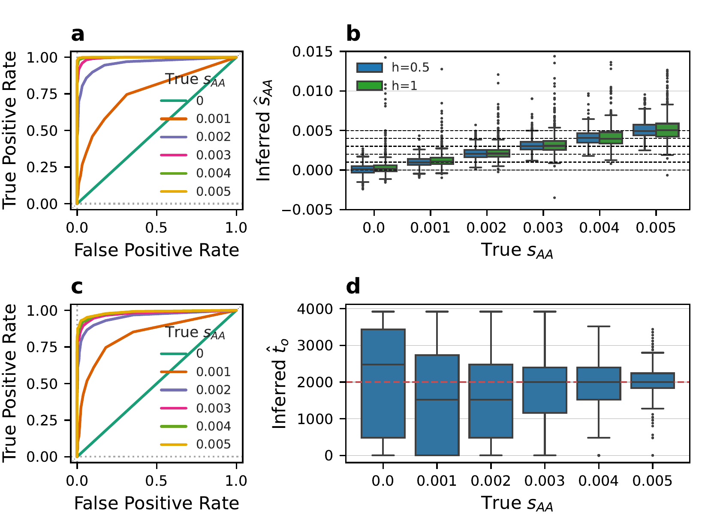

## Figure 1: ROC curves an accuracy of MLEs

This figure shows ROC curves and the acccuracy of the MLEs under additive selelction and full dominance (h=1), when simulating from stading variation. These results are a subset of the results from the analysis in [../supp_figS1-S7_DLsims](../supp_figS1-S7_DLsims), and thus the analysis in that folder has to be run first. The scripts listed here just collect results from that subdirectory.

In addition, the Figure contains a boxplot of the MLEs of the time of selection onset, from the analysis performed in [../supp_figS8_onset](../supp_figS8_onset). Thus, the analysis in that directory also has to be completed first.

Once you have run the previous analyses, run
```shell
python DLappnote_plot_fig1.py DL_main_fig1_ROC_MLE.pdf
```
to collect the results. The resulting figure is stored in the file `DL_main_fig1_ROC_MLE.pdf` and comprises Figure 1 in the main text. The figure is reproduced here:


