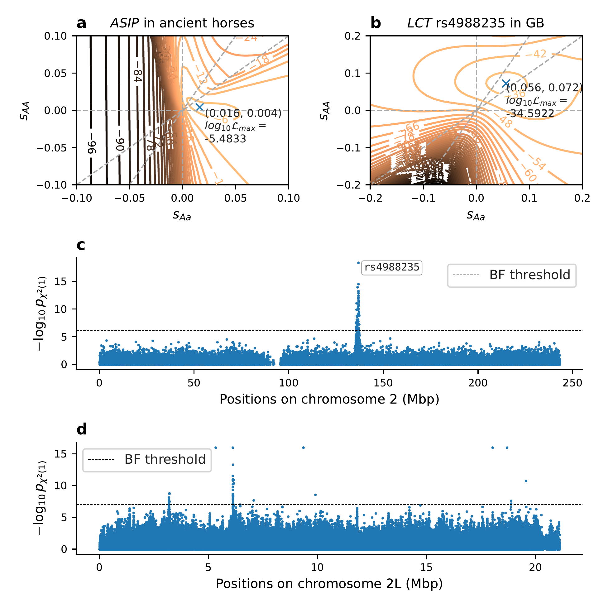

## Figure 2: Manhattan plots for human and D. sim data; Likelihood surfaces for rs4988235 in humans and ASIP in horses.

These scripts compile Figure 2 in the main text.

`diplo-locus` has to be installed for the following scripts to run. In addition to the packages required by `diplo-locus`, the python module `seaborn>=0.13.2` is required.

#### Chromosome-wide p-values for human chr 2 and D. sim chr. 2L

Figure 2 contains a chromosome-wide manhattan plot of p-values under additive selection for chromosome 2 for the human dataset from Great Britain, as well as chromosome 2L from an E&R experiment in D. simulans. These analyses are in the subdirectories [../supp_figS17-S18_LCT](../supp_figS17-S18_LCT) and [../supp_figS19-S21_dsim](../supp_figS19-S21_dsim), respectively. Thus, the analyses in those subdirectories have to be completed first, before the scripts detailed here can be used to collect the results.


#### 2-dimensional likelihood surface for locus LCT (rs4988235)

The data for chromosome 2 needs to be extracted, thus the following also requires that the extraction steps in [../supp_figS17-S18_LCT](../supp_figS17-S18_LCT) have been completed. To compute the 2D likelihood surface of general diploid selection for SNP rs4988235 in the _LCT_/_MCM6_ locus, run (takes approx. 1/2 hours):
```shell
extracted_prefix="../supp_figS17-S18_LCT/extracted/"
extracted_vcf=$extracted_prefix"UK_v54.1_1240K_noFam_strictPASS_from4500_c2.vcf"
info_file=$extracted_prefix"UK_v54.1_1240K_noFam_strictPASS_from4500.table"
lct_prefix="UK_v54.1_1240K_from4500_rs4988235_MAF.05_51x51linGrid2e-1"

DiploLocus likelihood --Ne 37000 --u01 1.25e-8 --gen_time 28.1 \
                      --vcf $extracted_vcf --info $info_file \
                      --ID_col="Genetic_ID" --time_ago_col="Date_mean" \
                      --force_hap all --minMAF 0.05 --snps rs4988235 \
                      -o $lct_prefix --init uniform --minK 2 \
                      --linear_s2_range="-0.2,0.2,50" --linear_s1_range="-0.2,0.2,50" \
                      --get_on_grid_max --get_MLR --gzip_surface
```
The output will be stored in the files `UK_v54.1_1240K_from4500_rs4988235_MAF.05_51x51linGrid2e-1_LLmatrices.table.gz` and `UK_v54.1_1240K_from4500_rs4988235_MAF.05_51x51linGrid2e-1_on-grid_maxLLs.txt`, and will be used to plot the surface.

#### 2-dimensional likelihood surface for locus ASIP from ancient horse dataset

The temporal frequencies of the ASIP locus in ancient horses colleted by Ludwig et al. (2009) was analyzed in [../supp_figS16_ASIP](../supp_figS16_ASIP) for different times of introduction of the selected allele, so the analysis in that directory needs to be completed first. Here we plot the surface for $t_0=13,105$, which resulted in the highest likelihood and is stored in the file `../supp_figS16_ASIP/ex1_ASIP_t13105_-init_51x51linGrid1e-1_LLmatrices.table`.

#### Combine in one plot

To combine the Manhattan plots for the $p$-values of chromosome 2 from the Great Britain human data, the $p$-values from the E&R experiment in D. melanogaster, the likelihood surface for SNP rs4988235 from the Great Britain data, and the likelihood surface for the ASIP locus in ancient horses, run
```shell
python DLappnote_plot_fig2.py DL_main_fig2_dsim_lct_asip.pdf
```
This results in the file `DL_main_fig2_dsim_lct_asip.pdf` which is Figure 2 in the main text:
