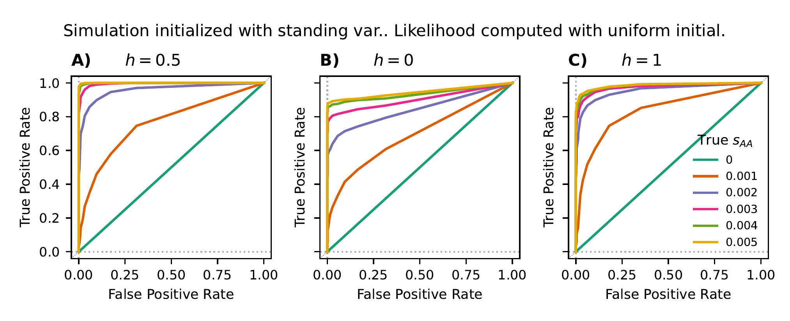
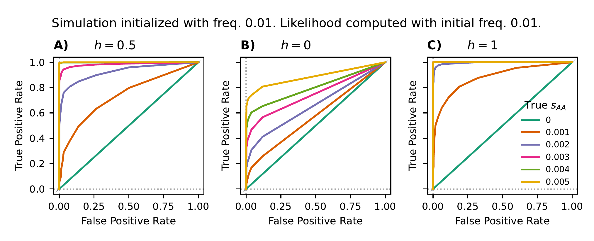
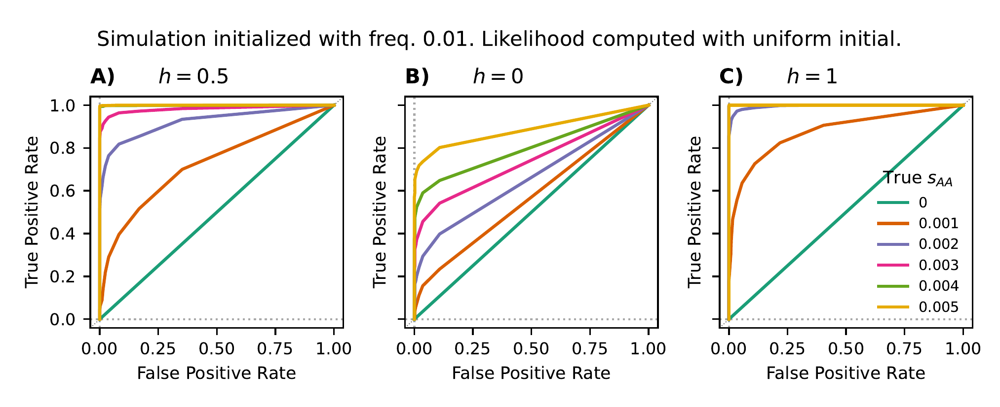
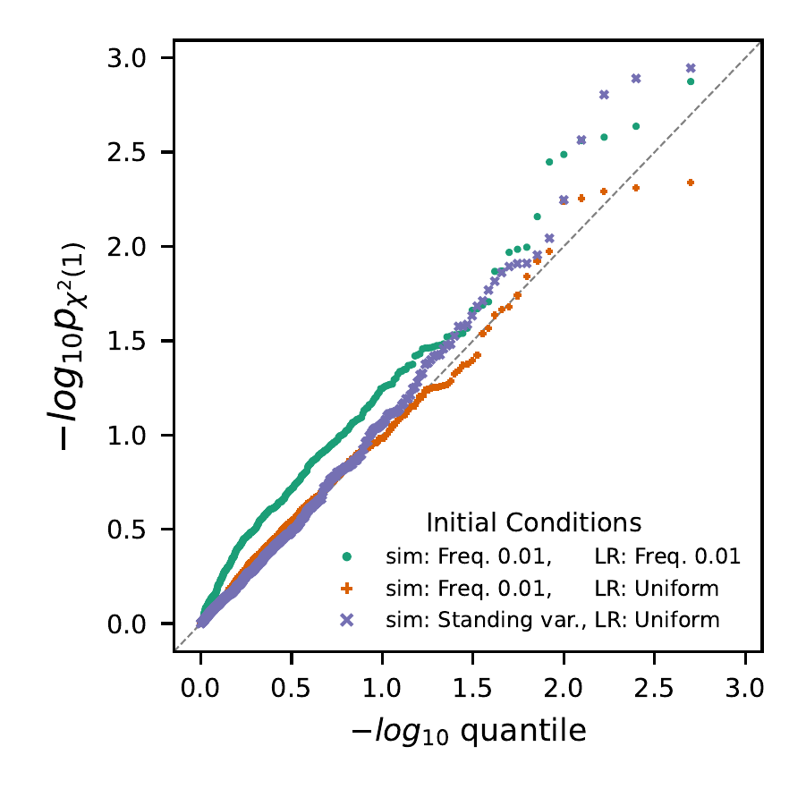
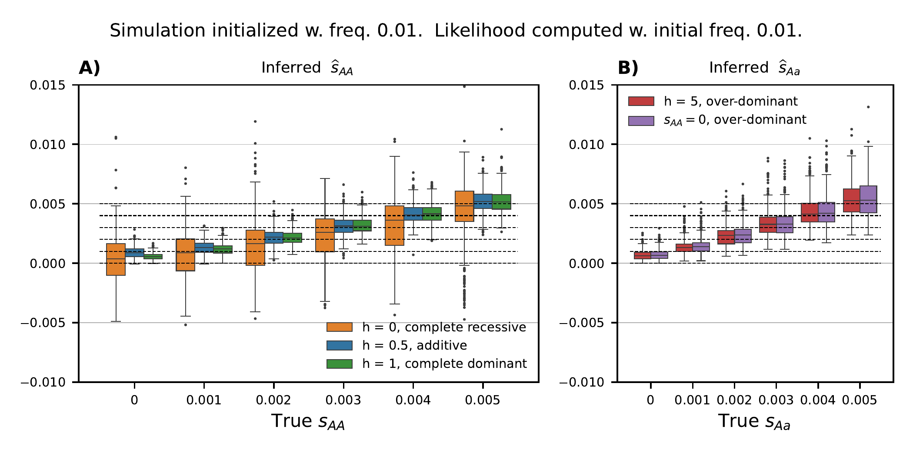
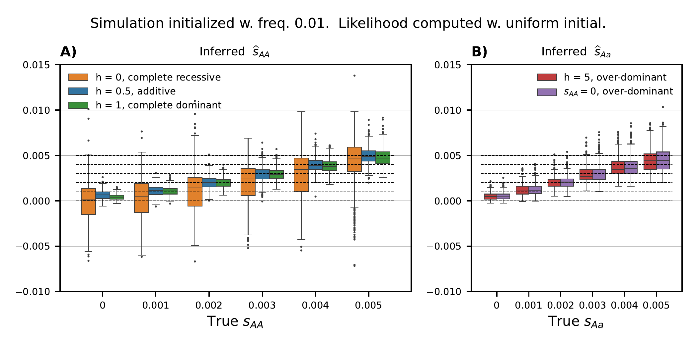
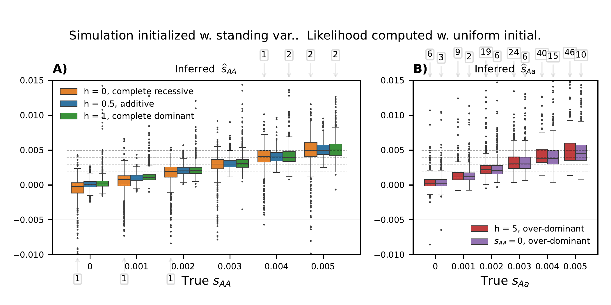

## Fig. S1 - S7:  Data simulation and likelihood-based inference

- [1.1 Data generation](#DL_sim)
- [1.2 Plotting](#DL_plot)
  - [1.2.1 Receiver Operating Characteristic (ROC) curves (Fig. S1 - S3)](#DL_rocs)
  - [1.2.2 Quantile-quantile plots (QQ-plots) for the distributions of likelihood ratio test statistics (Fig. S4)](#DL_qq)
  - [1.2.3 Boxplots for max-likelihood estimates (MLEs) (Fig. S5 - S7)](#DL_box)

Navigate to the corresponding subdirectory and create a folder to keep all the simulated data:
```shell
# navigate to the directory
cd supp_figS1-S7_DLsims/
# create folder for simulated data
mkdir simulations/
```
The python-scripts in this section use the API of the python-module `diplo_locus` to simulate and analyze data. In addition to `diplo-locus`, the python module `seaborn>=0.13.2` is required.

### 1.1 Data generation
<a id="DL_sim"> </a>

To simulate replicates and compute their likelihoods, run
```shell
# Run analysis for different s_AA values: 
## Simulations initiated with Watterson's neutral distribution (standing variation)
## Usage: 
## python step1_DL_sim2mlr_stdVar.py <outprefix> <neut_samples_pkl> <init_distn> <minMAF> [seed]
python step1_DL_sim2mlr_stdVar.py simulations/varS2 "none_yet" initDistn_watterson-N1e4.txt 0.05 87235

## Likewise, to simulate data from initial frequency of 0.01:
## Usage:
## python step1_DL_sim2mlr_initFreq.py <outprefix> <neut_samples_pkl> <minMAF> [seed]
python step1_DL_sim2mlr_initFreq.py simulations/varS2 "none_yet" 0.05 10827

# Run analyses for different S_aA values:
## Usage:
## python step1_DL_sim2mlr_s1-var.py <outprefix> <neut_samples_pkl> <init_distn> <minMAF> [seed]
python step1_DL_sim2mlr_s1-var.py simulations/varS1 "none_yet" initDistn_watterson-N1e4.txt 0.05 9567 
```

For scenarios where true $s_\text{AA}$ (i.e. `s2`) varies, with either type of simulation initial condition, 3 values for the dominance coefficient `h`, $h \in \{0, 0.5, 1\}$, and 6 values for the selection coefficient `s2`, $s_\text{AA} \in \{0, 0.001, 0.002, 0.003, 0.004, 0.005\}$ are simulated and analyzed.

For scenarios where true $s_\text{Aa}$ (i.e. `s1`) varies, with either type of simulation initial condition, 2 values for the dominance coefficient `h`, $h \in \{5, \infty\}$ (the case $h=\infty$ is equivalent to setting `s2=0` with the given `s1` value), and 5 values for the selection coefficient `s1`, $s_\text{AA} \in \{0.001, 0.002, 0.003, 0.004, 0.005\}$ are simulated and analyzed.

 For each combination of parameters, 500 replicates are generated, conditioning on each replicate's:
* population allele frequency never falls below $1/(4N_e)$ (equivalent to allele not being lost), and
* pooled minor sample allele frequency be greater than 0.05.

Each replicate is simulated with either a fixed initial frequency at 0.01, or from standing variation. The later uses the file `initDistn_watterson-N1e4.txt`, which contains a list of probabilities for different initial frequencies, pre-computed using the formula for Watterson's neutral distribution. All replicates are analyzed using either a fixed intial frequency at 0.01 or the uniform distribution. The effective population size for simulation and analysis is set to 10,000.

When computing likelihood surfaces, a symmetrical geometric grid (including zero) of $s$ values is used. The user can obtain the same grid with the following code in an interactive python session:
```python
from diplo_locus.utility import _get_geom_grid
s_grid = _get_geom_grid(-0.75, 0.75, 50, Ne=1e4)
s_grid
# array([-7.50000000e-01, -5.10969052e-01, -3.48119163e-01, -2.37170825e-01,
#        -1.61582602e-01, -1.10084945e-01, -7.50000000e-02, -5.10969052e-02,
#        -3.48119163e-02, -2.37170825e-02, -1.61582602e-02, -1.10084945e-02,
#        -7.50000000e-03, -5.10969052e-03, -3.48119163e-03, -2.37170825e-03,
#        -1.61582602e-03, -1.10084945e-03, -7.50000000e-04, -5.10969052e-04,
#        -3.48119163e-04, -2.37170825e-04, -1.61582602e-04, -1.10084945e-04,
#        -7.50000000e-05,  0.00000000e+00,  7.50000000e-05,  1.10084945e-04,
#         1.61582602e-04,  2.37170825e-04,  3.48119163e-04,  5.10969052e-04,
#         7.50000000e-04,  1.10084945e-03,  1.61582602e-03,  2.37170825e-03,
#         3.48119163e-03,  5.10969052e-03,  7.50000000e-03,  1.10084945e-02,
#         1.61582602e-02,  2.37170825e-02,  3.48119163e-02,  5.10969052e-02,
#         7.50000000e-02,  1.10084945e-01,  1.61582602e-01,  2.37170825e-01,
#         3.48119163e-01,  5.10969052e-01,  7.50000000e-01])
```

The parameter settings described above are specified in the respective python scripts. To consider other alternatives, the user should modify the scripts accordingly.

With the given parameters, it takes ~0.5 cpu hours hours to generate either of the `varS2` simulations (variying `s2`), or the `varS1` simulations (variying `s1`). The `.pkl` files generated from these pipelines require about ~6 GB of space.

### 1.2 Plotting
<a id="DL_plot"> </a>

#### 1.2.1 Receiver Operating Characteristic (ROC) curves (Fig. S1 - S3)
<a id="DL_rocs"> </a>

To replicate the figures in the manuscript from the simulated data, run
```shell
# plot ROC from the off-grid max-likelihood likelihood ratios
## Usage:
## python plot_DLsim_ROCs.py <generic_s2_pkl> <generic_s1_pkl> <sim_init> <fig_prefix>
### generic names of .pkl files that contain the likelihood computation results. Use the "*" wildcard character(s) to match all files
s2_pkl_name="simulations/varS2_fromSeed87235_simInitSV_h\*LLinit\*_offGridMLE.pkl" 
s1_pkl_name="simulations/varS1_fromSeed9567_simInitSV_simH\*LLinit\*_offGridMLE.pkl" 
### prefix of the ROC figure
roc_prefix="simInitSV_s2-87235_s1-9567"
# now plot
python step2_plot_DLsim_ROCs.py ${s2_pkl_name} ${s1_pkl_name} "simInitSV" ${roc_prefix} 
```
The commands above will generate multi-panel ROC curves for simulations initiated with the given distribution.



Likewise, ROCs for simulations with the fixed initial frequency of 0.01 can be generated using the same script:
```shell
# plot ROC from the off-grid max-likelihood likelihood ratios
### generic name of .pkl files that contain the likelihood computation results. Use the "\*" wildcard character(s) to match all files
s2_pkl_name="simulations/varS2_fromSeed10827_simInitFreq.01_h\*LLinit\*_offGridMLE.pkl" 
s1_pkl_name="simulations/varS1_fromSeed9567_simInitFreq.01_simH\*LLinit\*_offGridMLE.pkl" 
### prefix of the ROC figure
roc_prefix="simInitFreq.01_s2-10827_s1-9567"
# now plot
python step2_plot_DLsim_ROCs.py ${s2_pkl_name} ${s1_pkl_name} "simInitFreq.01" ${roc_prefix} 
```






([Back to TOC](../README.md#toc))

#### 1.2.2 Quantile-quantile plots (QQ-plots) for the distributions of likelihood ratio test statistics (Fig. S4)
<a id="DL_qq"> </a>

To generate QQ-plots as shown in Fig S4, run the script `step2_plot_DLsim_QQplot.py` on data generated in the previous step ($h=0.5$, _i.e._ additive):

```shell
# Collect simulation pkls, compare quantiles of LLRs against standard chi-square (df=1)
### simulations initiated with standing variation (SV):
freq_pkl_name="simulations/varS2_fromSeed10827_simInitFreq.01_h\*LLinit\*_offGridMLE.pkl" 
### simulations initiated with  fixed frequency (Freq.01):
sv_pkl_name="simulations/varS2_fromSeed87235_simInitSV_h\*LLinit\*_offGridMLE.pkl" 
### name of qqplot
fig_name="QQplot_fixH.5_3initCombos_freq10827-sv87235.pdf"
## Usage:
## python %prog <freq_pkl> <sv_pkl> <fig_name>
python step2_plot_DLsim_QQplot.py ${freq_pkl_name} ${sv_pkl_name} ${fig_name}
```



#### 1.2.3 Boxplots for max-likelihood estimates (MLEs) (Fig. S5 - S7)
<a id="DL_box"> </a>

The plotting script `step2_plot_DLsim_contrastBoxes.py` has the same usage as `step2_plot_DLsim_ROCs.py`.

In addition to two plots---one for either initial condition adopted in likelihood computation---it will also produce two tables with outlier replicates whose MLEs fall outside the range covered by the y-axes in the plot (set as $[-0.01, 0.015]$).

```shell
# plot boxplots for MLEs
## simulations initiated with standing variation (SV):
s2_pkl_name="simulations/varS2_fromSeed87235_simInitSV_h\*LLinit\*_offGridMLE.pkl" 
s1_pkl_name="simulations/varS1_fromSeed9567_simInitSV_simH\*LLinit\*_offGridMLE.pkl" 
### prefix of the figure
prefix="simInitSV_s2-87235_s1-9567"
# now plot
python step2_plot_DLsim_contrastBoxes.py ${s2_pkl_name} ${s1_pkl_name} "simInitSV" ${prefix} 

## simulations initiated with fixed frequency (Freq.01):
s2_pkl_name="simulations/varS2_fromSeed10827_simInitFreq.01_h\*LLinit\*_offGridMLE.pkl" 
s1_pkl_name="simulations/varS1_fromSeed9567_simInitFreq.01_simH\*LLinit\*_offGridMLE.pkl" 
### $s1_pkl_name stays the same
prefix="simInitFreq.01_s2-10827_s1-9567"
# now plot
python step2_plot_DLsim_contrastBoxes.py ${s2_pkl_name} ${s1_pkl_name} "simInitFreq.01" ${prefix} 
```







