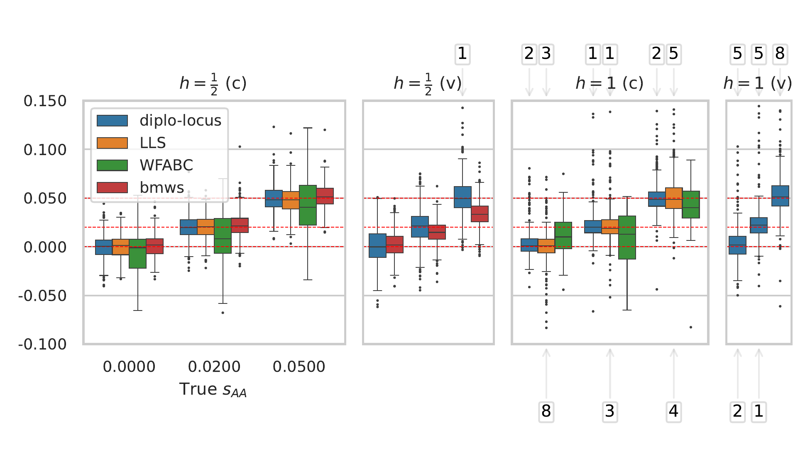
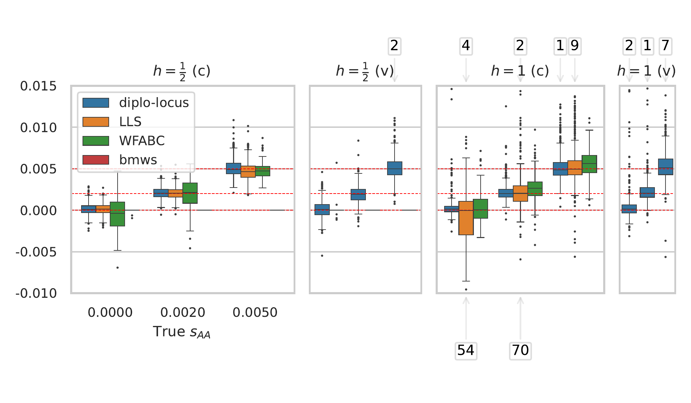

## Fig. S13 - S14: Benchmarking `DiploLocus`

The following scripts can be used to benchmark the methods __diplo-locus__, __LLS__, __WFABC__, and __bmws__ on simulated data. The results are given in Table 1 in the main text and Figure S13 and S14 in the supplemental material.

To run the scripts, change into the sub-directory `supp_figS13-S14_comparison/`. Make that sure all required executables are available:

- Install __diplo-locus__: Confirm that `DiploLocus-likelihood` and `DiploLocus-simulate` can be called from the command line after running:
```
pip install "git+https://github.com/steinrue/diplo_locus@v1.2.0"
```

- Install __LLS__: Confirm that the executable `Rscript` is available on the command line and follow the installation instructions at https://github.com/ThomasTaus/poolSeq.

- Install __WFABC__: Download `WFABC v1.1` from http://jjensenlab.org/software (http://jjensenlab.org/wp-content/uploads/2016/02/WFABC_v1.1.zip). Extract the archive and ensure that the binaries `./WFABC_v1.1/binaries/Linux/wfabc_1` and `./WFABC_v1.1/binaries/Linux/wfabc_2` are available to execute (using these exact commands) from within the `supp_figS13-S14_comparison/` directory. 

- Install __bmws__: To install __bmws__, as detailed at https://github.com/jthlab/bmws, (commit `ef2fc2e`) and make the command `bmws` available on the command line, run
```
pip install -e git+https://github.com/jthlab/bmws#egg=bmws
```

In addition to the packages required by `diplo-locus` and `bmws`, the following packages are needed. We used the specified versions, but the scripts might also work with other versions:
- `seaborn-0.13.2`.

__Note__: The scripts are currently set up to run on an HPC environment with the SLURM queueing system, which is especially relevant when collecting the runtime. Changing `THE_EXECUTOR = execution_engine.FileExecutor()` at the beginning of each script to `THE_EXECUTOR = execution_engine.SubprocessExecutor()` modifies the scripts to run the commands directly on the command line without the SLURM queueing system. Collecting the runtimes would have to be modified accordingly.

### Simulate data

#### Step 1a:
Running
```
python step1_simulate_data.py
```
generates the file `SLURM_SIMULATE.txt` with one simulation command on each line. Note that the script exits with an assertion that is `false`, since no data is simulated yet. The script also creates the sub-directory `simulated_data/`, which contains temporary files for now, but will ultimately contain the simulated datasets.

#### Step 1b:
Running
```
python slurmify.py SLURM_SIMULATE.txt simulate no_benchmark
```
creates the shell script `submit_simulate.sh` with commands to submit simulation jobs to SLURM and the sub-direcory `slurmify_simulate/` that contains said simulation jobs.

#### Step 1c:
Run
```
sh submit_simulate.sh
```
to submit the simulation jobs to the SLURM queue. After this command, wait until all jobs are finished.

#### Step 1d:
Once all simulation jobs are finished, run
```
python step1_simulate_data.py
```
again. This will now collect the simulated data and store it in the correct format for the respective method in the sub-directories `results_bmws/`, `results_diplo_locus/`, `results_lls/`, and `results_wfabc/`.

### Set up analysis of data using different methods

#### Step 2:
```
python step2_analyze_diplo_locus.py
```
generates the file `SLURM_ANALYZE.txt` that contains the commands to analyze the simulated data using __diplo-locus__; one command per line.

#### Step 3:
```
python step3_analyze_lls.py
```
adds the commands to analzye the simulated data using __LLS__ to file `SLURM_ANALYZE.txt`; one command per line.

#### Step 4:
```
python step4_analyze_wfabc.py
```
adds the commands to analzye simulated data using __WFABC__ to file `SLURM_ANALYZE.txt`; one command per line.

#### Step 5:
```
python step5_analyze_bmws.py
```
adds the commands to analzye simulated data using __bmws__ to add to file `SLURM_ANALYZE.txt`; one command per line.

### Submit commands for analsis using SLURM

#### Step *a:
```
python slurmify.py SLURM_ANALYZE.txt analyze benchmark
```
creates the shell script `submit_analyze.sh` with commands to submit the analysis jobs to slurm and the sub-direcory `slurmify_analyze/` that contains said jobs.

#### Step *b:
```
sh submit_analyze.sh
```
submits the analysis jobs to the SLURM queue.

### Collect results of analysis

#### Step 6:

Once all jobs finished, run
```
python step6_collect_results.py
```
to collect the results of the analysis. The script generates the files `box_g160.pdf` and `box_g4000.pdf`, which are Figure S13 and S14 in the supplemental material, respectively. It also generates the file `time_table.tex`, which is used to generate Table 1 in the main text.

These are the boxplots generated.

`box_g160.pdf`:



`box_g4000.pdf`:


