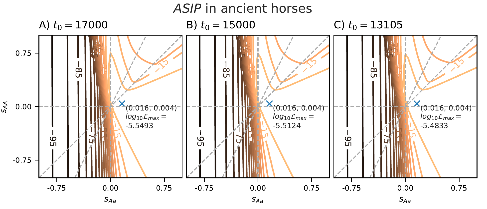

## Figure S16: Likelihood surfaces for ASIP in horses.

These scripts generate Figure S16 in the supplement, specifically, computing 2D likelihood surfaces from the ASIP data for ancient horses with different times for the origin of the selected allele.

`diplo-locus` has to be installed for the following scripts to run. In addition to the packages required by `diplo-locus`, the python module `seaborn>=0.13.2` is required.

#### 2-dimensional likelihood surfaces for locus ASIP from ancient horse dataset

The sampled-allele frequencies from the dataset of ancient horses at the ASIP locus compiled by Ludwig et al. (2009), as analyzed by Steinrücken et al. (2014), are provided in the file `ex1_HorseLoci_count.txt`. To compute 2-dimensional likelihood surfaces with different times of origin {17000, 15000, 13105} years before present for the selected allele, run:
```shell
for var_t in {17000,15000,13105}; do
  DiploLocus likelihood --u01 1e-6 --Ne 16000 --gen_time 8 \
                -i ex1_HorseLoci_count.txt \
                --sample_times_ago 20000,13100,3700,2800,1100,500 \
                --init initFreq --initFreq 3.125e-5 --t0 ${var_t} --force_t0 \
                --linear_s1_range="-0.1,0.1,50" \
                --linear_s2_range="-0.1,0.1,50" \
                -o ex1_ASIP_t${var_t}_-init_51x51linGrid1e-1
done
```
Computing these likelihoods takes approximately 7 hours. The output will be stored in the files `ex1_ASIP_txxxxx_-init_51x51linGrid1e-1_LLmatrices.table` and will be used to plot the surfaces.

#### Generate plot for Figure S16 in the supplement.

To generate the plot all three surfaces for the different times of origin, run
```shell
python plot_surfaces_ASIP_vt.py surfaces_ASIP_vt.pdf
```
This results in the file `surfaces_ASIP_vt.pdf` which is Figure S16 in the supplement:

