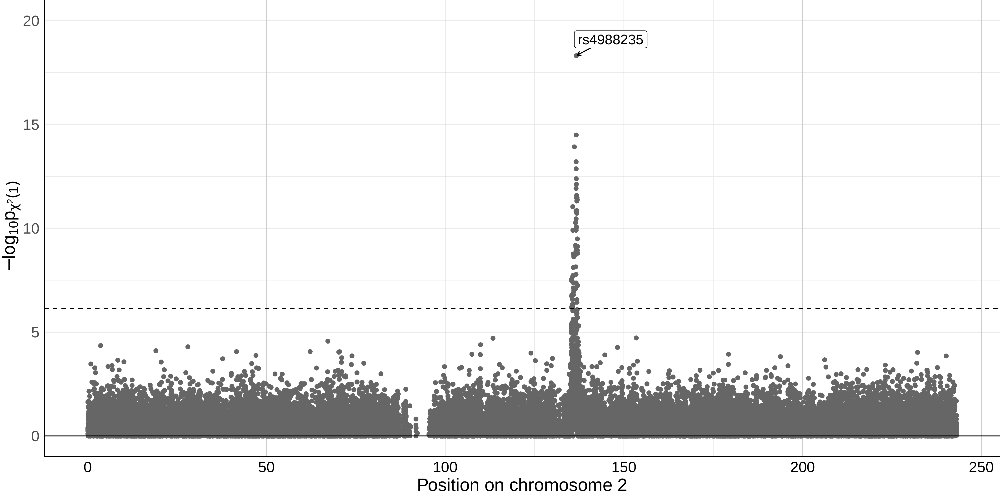
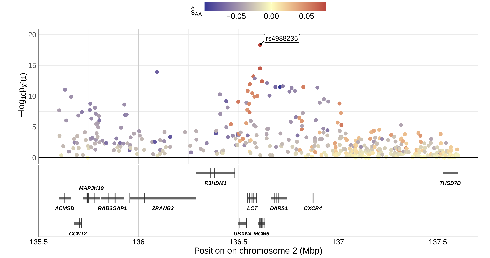

## Figure S17 - S18: Examining genotype data around *LCT* gene in GB population from AADR database

- [1 Data download and parsing](#AADR)
- [2 `DiploLocus` scans along 1-dimensional parameter space](#runDL_1D)


### 1. Data download and parsing
<a id="AADR"> </a>

Data for this example is extracted from the Allen Acient DNA Resources databse v54.1 available as Dataverse V7 at https://doi.org/10.7910/DVN/FFIDCW. Note that some versions of `curl` do not require `-L` in front of the url.
```shell
# Move to the corresponding folder
cd supp_figS17-S18_LCT/

# create directory for dataset
mkdir aadr_v54.1_1240K
cd aadr_v54.1_1240K

# Download dataset
## This step might take a while depending on the internet bandwidth
# aadr_v54.1_1240K_public.anno - size: 6.2 MB
curl -L https://dataverse.harvard.edu/api/access/datafile/7052536 -o aadr_v54.1_1240K_public.anno
# aadr_v54.1_1240K_public.geno - size: 4.7 GB
curl -L https://dataverse.harvard.edu/api/access/datafile/7052537 -o aadr_v54.1_1240K_public.geno
# aadr_v54.1_1240K_public.ind - size: 669.5 KB
curl -L https://dataverse.harvard.edu/api/access/datafile/7052538 -o aadr_v54.1_1240K_public.ind
# aadr_v54.1_1240K_public.snp - size 74.1 MB
curl -L https://dataverse.harvard.edu/api/access/datafile/7052539 -o aadr_v54.1_1240K_public.snp

# check files
ls .
# aadr_v54.1_1240K_public.anno  aadr_v54.1_1240K_public.geno 
# aadr_v54.1_1240K_public.ind  aadr_v54.1_1240K_public.snp

## Return to the main folder
cd ..
```
The downloaded files are in EIGENSTRAT format and contain data for all genomes from a number of published ancient DNA studies. To make subsequent file-handling easier, we first generate a subset of samples from GB and then convert the EIGENSTRAT format to VCF. As described in the manuscript, these samples are:

* sampled from Great Britain,
* dated to be no older than 4500 years before present.
* genotyped usgin the 1240K SNP-set capture,
* un-related to any other samples in the dataset,
* assessed as "PASS" in the dataset.

To extract these samples, run: 

```shell
# create the folder to store vcfs
mkdir extracted/
# run script
python step1_extractIDsFromAnnoUK.py
```
This step will generate the file `extracted/UK_v54.1_1240K_noFam_strictPASS_from4500.table`, which will be used to create the requisite VCF file.

To this end, we use tools from the [gdc](https://github.com/mathii/gdc) and the [pyEigenstrat](https://github.com/mathii/pyEigenstrat) package to convert EIGENSTRAT-formatted data to VCF format. This step is done with the following command:

```shell
# convert eigenstrat to vcf:
## we only extract chromosome 2, where the LCT gene is located
python step2_extractUKTimeSeries_byChr.py 2
```
The converted VCF file will be `extracted/UK_v54.1_1240K_noFam_strictPASS_from4500_c2.vcf`.

### 2. `DiploLocus` scans along 1-dimensional parameter space for additive selection
<a id="runDL_1D"> </a>

To use the `DiploLocus` to compute likelihoods for all SNPs on chromosome 2 on a 1D surface of genic selection coeffeicients (h = 0.5), and compute significance under the corresponding likelihood ratio test, run (takes approx. 4 hours):
```shell
extracted_vcf="extracted/UK_v54.1_1240K_noFam_strictPASS_from4500_c2.vcf"
info_file="extracted/UK_v54.1_1240K_noFam_strictPASS_from4500.table"
out_prefix="v54_chr2_UK_1240K_from4500_MAF.05_fixH.5_51x5e-1geomGrid"

DiploLocus likelihood --Ne 37000 --u01 1.25e-8 --gen_time 28.1 \
                      --vcf $extracted_vcf --info $info_file \
                      --ID_col="Genetic_ID" --time_ago_col="Date_mean" \
                      --force_hap all --minMAF 0.05 -o $out_prefix --init uniform \
                      --geom_s2_range="-0.5,0.5,50" --fix_h 0.5 --minK 2 \
                      --get_off_grid_max --get_MLR --get_chi2_pval -v
```
The above step will generate the output files `v54_chr2_UK_1240K_from4500_MAF.05_fixH.5_51x5e-1geomGrid_LLmatrices.table` and `v54_chr2_UK_1240K_from4500_MAF.05_fixH.5_51x5e-1geomGrid_off-grid_maxLLs.txt`, the latter of which is necessary to generate Figure 2 in the main manuscript (see [main_fig2](../main_fig2/README.md)) and Figure S17. To generate Figure S17, run:
```shell
# This R script requires tidyverse, data.table, ggplot2, ggrastr
# reshape2, ggpubr, ggrepel, RColorBrewer, and latex2exp.
mlr_file="v54_chr2_UK_1240K_from4500_MAF.05_fixH.5_51x5e-1geomGrid_off-grid_maxLLs.txt"
chr_plot="pvals-wCutoff_chr2_MAF.05_unif_fixH.5_51xgeom5e-1.pdf"
## Generate Manhattan plot for all of chromosome 2:
Rscript plotScores_noGenes.r $mlr_file 2 pval $chr_plot
```


The same file can also be used to examine specific regions. To exhibit the 2Mb region around the _LCT_ locus on chromosome 2 (Figure S18), run:

```shell
mlr_file="v54_chr2_UK_1240K_from4500_MAF.05_fixH.5_51x5e-1geomGrid_off-grid_maxLLs.txt"
lct_plot="pval-wCutoff_2Mb_chr2_1356e5-1376e5_MAF.05_unif_fixH.5_51xgeom5e-1.pdf"
## Generate colorscaled plot for LCT/MCM6 region:
Rscript plotScores_wGenes.r $mlr_file 2 1356e5 1376e5 pval $lct_plot
```
Note that the file `hg19_ncbiRefSeq-All_2023May_allFields.txt` is required for this script.


