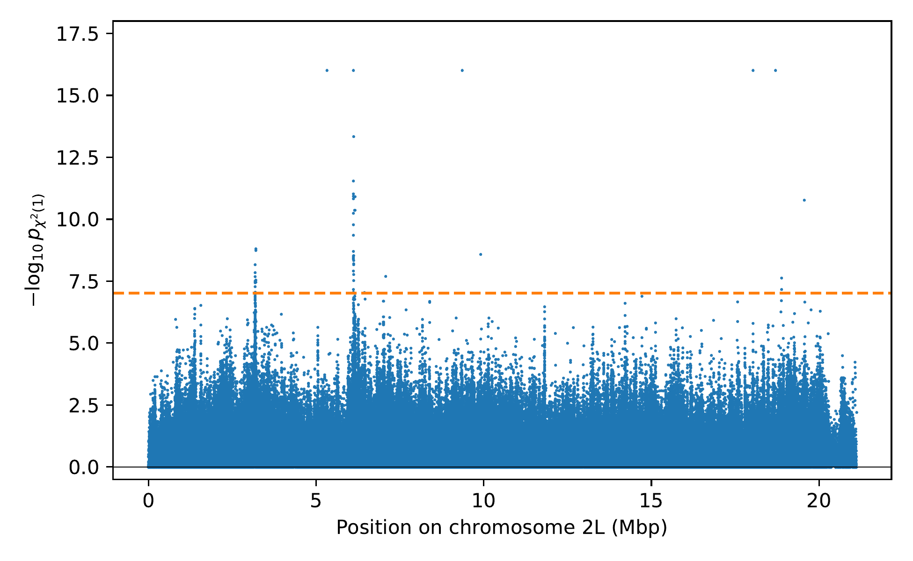
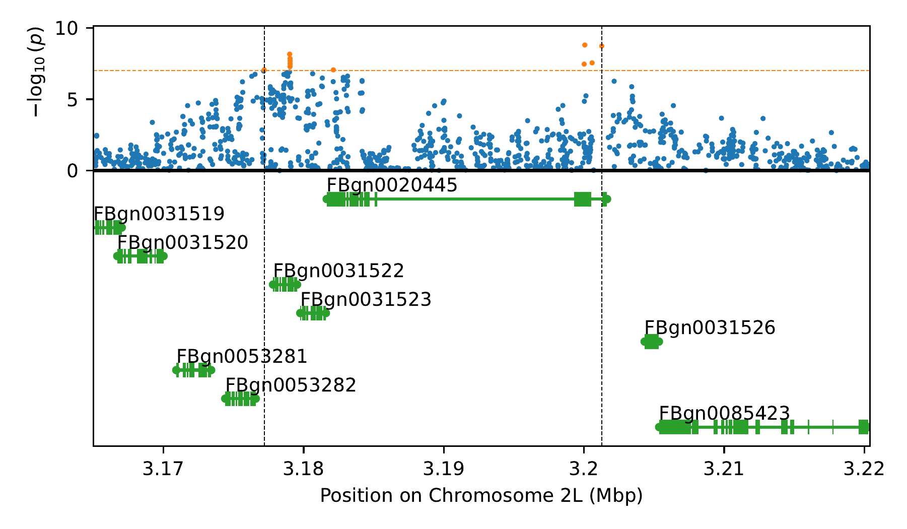
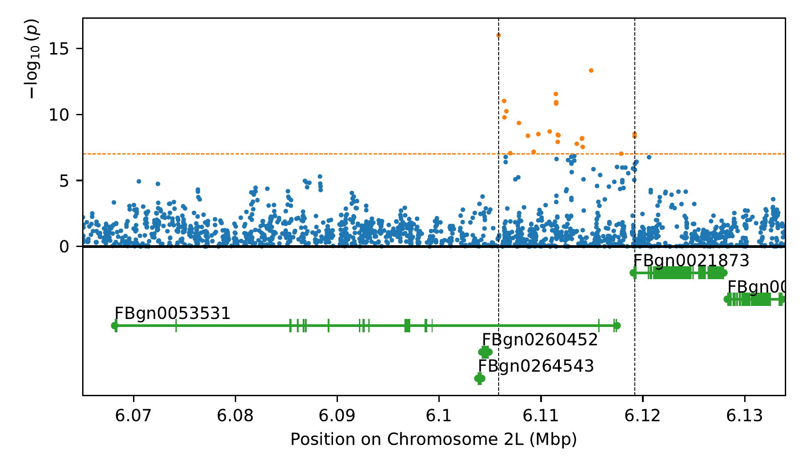

## Fig. S17 - S19: Analyzing Evolve & Resequence data for Drosophila simulans

The scripts in this folder are used to analyze the temporal data from Barghi et al. (2019) [https://doi.org/10.1371/journal.pbio.3000128] using __diplo-locus__. This data is collected from an Evolve & Resequence experiment where 10 replicates of Drosophila simulans populations where esposed to a new temperature regime, and temporal samples where taken over the course of the experiment. The scripts analyze the temporal genotype data from chromosome `2L`, and the results are shown in Figure S17 in the supplemental material and Figure 2 in the main text.

### Install required python packages

In addition to __diplo-locus__ and its required packages, the scripts presented here need the following python modules. The scripts were tested with the indicated versions, but might run with other versions as well:
- `scipy-1.14.0`

### Download and prepare data

First, navigate to the sub-directory for this analysis and create a new folder for the data by running
```shell
# navigate to sub-directory
cd supp_figS17-S19_dsim/
# create directory for data
mkdir data
# navigate to data directory
cd data/
```
The genotype data and results from the analysis in Barghi et al. (2019) are stored on __DRYAD__ at https://doi.org/10.5061/dryad.rr137kn. For the analysis performed here, we download the genotype data, which can be obtain using the direct link https://datadryad.org/stash/downloads/file_stream/14282. Download the file `F0-F60SNP_CMH_FET_blockID.sync.zip` from this link, and place the downloaded file in the `data/` directory. Then unzip it by running
```shell
# unzip genotype data
unzip F0-F60SNP_CMH_FET_blockID.sync.zip

# list chromosomes and number of SNPs on respective chromosome
awk '{print $1}' Dsim_F0-F60_Q20_polymorphic_CMH_FET_blockID.sync |uniq -c
```
which results in the file `Dsim_F0-F60_Q20_polymorphic_CMH_FET_blockID.sync`. To extract the genotypes on chromsome `2L`, run 
```shell
# extract genotype data for chromosome 2L
grep '2L' Dsim_F0-F60_Q20_polymorphic_CMH_FET_blockID.sync \
        >chr2L_Dsim_F0-F60_Q20_polymorphic_CMH_FET_blockID.sync

# check that resulting file has only data for chromosome 2L
awk '{print $1}' chr2L_Dsim_F0-F60_Q20_polymorphic_CMH_FET_blockID.sync |uniq -c

# compress resulting file
gzip chr2L_Dsim_F0-F60_Q20_polymorphic_CMH_FET_blockID.sync
```
which creates the file `chr2L_Dsim_F0-F60_Q20_polymorphic_CMH_FET_blockID.sync.gz` with the genotype required for the analysis. 

The data is stored in sync-format. To convert it to major/minor allele counts, run
```shell
python ../process_sync.py chr2L_Dsim_F0-F60_Q20_polymorphic_CMH_FET_blockID.sync.gz \
        chr2L_F0-F60_all_reps.pickle.bz2
```
which creates the file `chr2L_F0-F60_all_reps.pickle.bz2`. If you want to save space on the hard-drive, you can now remove the files `Dsim_F0-F60_Q20_polymorphic_CMH_FET_blockID.sync`, `F0-F60SNP_CMH_FET_blockID.sync.zip` and `chr2L_Dsim_F0-F60_Q20_polymorphic_CMH_FET_blockID.sync.gz`.

Now that the data is prepared for the analysis, change directory back to the sub-directory of the analysis by running
```shell
cd ..
```

### Analyze temporal genotype data from chromsome 2L

To generate the __SLURM__ commands that perform the analysis, run
```shell
python analyze_chr2L.py
```
This will create the file `SLURM_ANALYZE_ALL.txt` containing the commmands. Running
```shell
python slurmify.py SLURM_ANALYZE_ALL.txt analyze_chr2L
```
will create the job-scripts to submit these commands to the __SLURM__ queue in the sub-directory `slurmify_analyze_chr2L` and also the script `submit_analyze_chr2L.sh` to submit these jobs to the queue by running
```shell
sh submit_analyze_chr2L.sh
```
Now wait until all analyses have completed, and then use the scripts in the next section to collect the results.

__Note__: These scripts are currently set up to run on an HPC environment with the __SLURM__ queueing system, using multiple cpu-cores. Changing `THE_EXECUTOR = execution_engine.FileExecutor()` at the beginning of the script `analyze_chr2L.py` to `THE_EXECUTOR = execution_engine.SubprocessExecutor()` modifies the scripts to run the commands directly on the command line without the SLURM queueing system. It might also be necessary to change the variables `NUM_CPUS` and `BLOCK_SIZE`, depeding on how many compute cores and memory is available.

### Collect results of the analysis

To collect the results and produce the manhattan plot of $p$-values combined across biological replicates using Fisher's method, run:
```shell
python collect_results.py
python plot_manhattan.py
```
This generates the file `dsim_manhattan_fisher.pdf` which is shown below and is Figure S17 in the supplemental material. The data collected in this step is also used to produce Figure 2 in the main text.




### Identifying genes in significant regions

The sequencing data from Barghi et al. (2019) [https://doi.org/10.1371/journal.pbio.3000128] is aligned using the pipeline from Barghi et al. (2017) [https://doi.org/10.1534/g3.117.043349] against the genome assembly M252 described by Palmieri et al. (2015) [https://doi.org/10.1111/1755-0998.12297]. The corresponding genome annotation can be obtained from __DRYAD__ at https://www.doi.org/10.5061/dryad.ng95t. The direct link https://datadryad.org/stash/downloads/file_stream/100473 can be used to directly download the file `dsim-M252-popgen-ann-r1.1.gtf` that contains the annotations.

Once you downloaded this file, you can run:
```shell
python plot_peaks.py
```
to generate the plots `dsim_peak1.pdf` and `dsim_peak2.pdf` that show the p-values around the two strong peaks (Figure S18 and S19 in the supplemtal material, respectively). The script also prints the FlyBase ids of the genes within 10 kb of both significant regions.




