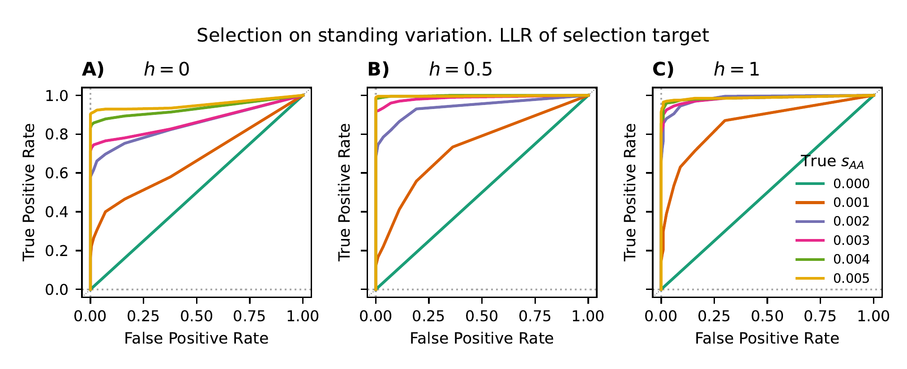
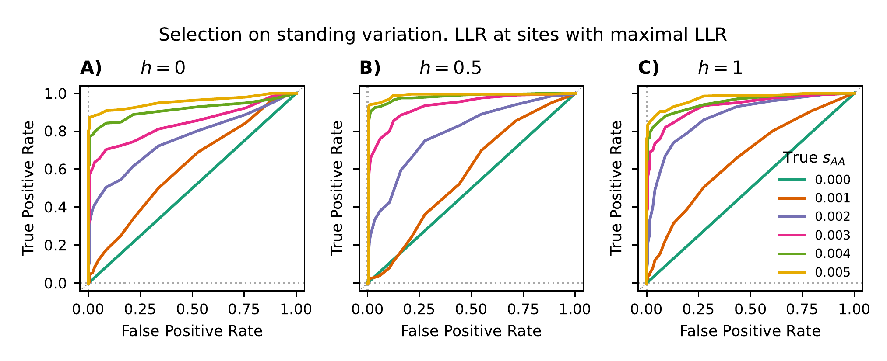
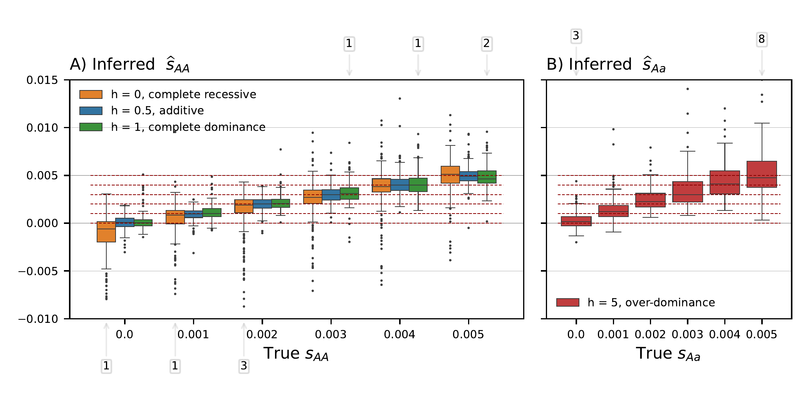
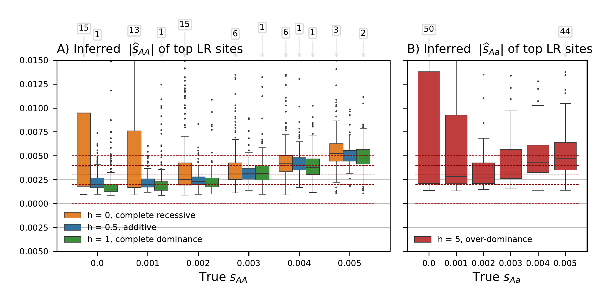
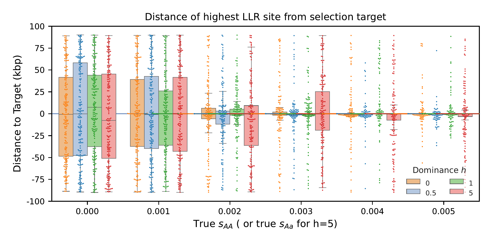

## Fig. S8 - S12: `DiploLocus` likelihood-based inference on `SLiM` simulations

- [2.1 Data generation on SLURM-managed HPC cluster](#Slim_sim)
- [2.2 Data summary](#Slim_summary)
- [2.3 Plotting](#Slim_plot)

The simulations and analyses in this section were performed on a high-performance computing (HPC) cluster using the SLURM system for queue-management, and thus the steps below assume such a system. While it is possible to modify the scripts to run on a local PC, it is not recommended due to the large amount of computing time needed. 

Before starting, the user must install [SLiM 4](https://messerlab.org/slim/), such that the software can be exceuted with the command `slim` on the command-line.  In their Python environment, the user must also install the packages `pyslim>=1.0.4` (which requires `jsonschema<4`), `msprime>=1.2.0`, `tskit>=0.5.4`, and `seaborn>=0.13.2`, in addition to the ones required by `diplo-locus`.

To start from the root directory, navigate to the current directory:
```shell
# navigate to the directory
cd supp_figS8-S12_SLiM/
```

### 2.1 Data generation on SLURM-managed HPC cluster
<a id="Slim_sim"> </a>

The script `step1_sim-pipeline.sh` calls two python scripts described below to simulated data. This bash script includes both the simulation/analysis pipeline (simulate + analyse using `DiploLocus`) and batch job parameters for SLURM.

1. The python script `run_MSinit_slim_reps_SV.py` will simulate a designated pool of replicates according to the procedure described in Section S3.1 in the supplemental material. It will follow the seeds for each replicate as specified in `slim4_input/` for the given scenarios. These seeds are identical to the ones used in manuscript.

2. The script `parseSlim4_TrackSel_var-t.py` will parse the SLiM output generated by each replicate simulation into an allele count table of all segregating variants on the simulated sequence. 

We simulate 200 replicates for each combination of selection parameters (selection coefficient of homozygotes $s$, and dominance coefficient $h$). For $s \in \{0, 0.001, 0.002, 0.003, 0.004, 0.005\}$ and $h \in \{0, 0.5, 1\}$ (unless $s=0$), there are 16 scenarios in total to simulate. For $h=5$, there are $s \in \{0.0002, 0.0004, 0.0006, 0.0008, 0.001 \}$, *i.e.* five scenarios, to simulate. These 21 scenarios corresponds to the 21 files in `slim4_input/` that contain the seeds.

To simulate each scenario, denote its selection parameters as `var_s` (only include digits following the decimal point) and `var_h`. The `sbatch` command to submit the batch jobs are enumerated as follows:

```shell
# Submit batch array jobs to simulate 200 replicate for each scenario
## Determine the number of array jobs needed:
num_replicates=200

## simulations with h <= 1
for var_h in {0,0.5,1}; do
  for var_s in {0,001,002,003,004,005}; do
    echo "simulating s = 0.${var_s} , h = ${var_h}."
    sbatch -J s${var_s}h${var_h}.${num_replicates}x \
           --export frac_s=${var_s},h=${var_h} \
           --array=0-$( expr ${num_replicates} - 1 ) step1_sim_pipeline.sh
  done
done

## simulations with h = 5
for var_s in {0,0002,0004,0006,0008,001}; do
echo "simulating s = 0.${var_s} , h = 5."
sbatch -J s${var_s}h5.${num_replicates}x \
       --export frac_s=${var_s},h=5 \
       --array=0-$( expr ${num_replicates} - 1 ) step1_sim_pipeline.sh
done
```

Alternatively, the user can refer the to commands in the `step1_sim_pipeline.sh` script to replicate the simulations in non-HPC environments or for different queueing systems.


### 2.2 Data summary
<a id="Slim_summary"> </a>

To collect computed likelihoods for all simulated data, use the commands:

```shell
# Usage:
# python %prog <minMAF> <name_prefix> [s1]
## collect h <= 1:
python step2_filter_n_summarize_Slim.py 0.05 DL 
## collect h > 1:
python step2_filter_n_summarize_Slim.py 0.05 DL s1
```

The `step2_filter_n_summarize_Slim.py` script will generate two tables in `.tsv.gz` format, respectively recording the parameters, position, and likelihood statistics (LL, LLR, MLE) of **i)** selection target sites, and **ii)** sites with highest LLR in the simulated genomic region for each replicate across all simulated scenarios. It will also generate two `.tsv` tables under each scenario folder summarizing replicates in this same scenario. 

The above commands, should create the output tables:
```
DL-varS2_selected-sites_minMAF.05_200kb_t9x500gen_n40_3h6s_Concatenated_offGrid_Dist.tsv.gz
DL-varS2_maxLR-sites_minMAF.05_200kb_t9x500gen_n40_3h6s_Concatenated_offGrid_Dist.tsv.gz
DL-varS1_selected-sites_minMAF.05_200kb_t9x500gen_n40_1h6s_Concatenated_offGrid_Dist.tsv.gz
DL-varS1_maxLR-sites_minMAF.05_200kb_t9x500gen_n40_1h6s_Concatenated_offGrid_Dist.tsv.gz
```


### 2.3 Plotting
<a id="Slim_plot"> </a>

The python scripts with prefix `step3_` are all used to generate plots based on the tables generated in the previous step. To generate the ROC curves (Fig. S8, Fig. S11), run:

```shell
# Plot SLiM simulation results
## save the filenames for convenience
tsv_s2_target="DL-varS2_selected-sites_minMAF.05_200kb_t9x500gen_n40_3h6s_Concatenated_offGrid_Dist.tsv.gz"
tsv_s2_maxLR="DL-varS2_maxLR-sites_minMAF.05_200kb_t9x500gen_n40_3h6s_Concatenated_offGrid_Dist.tsv.gz"
tsv_s1_target="DL-varS1_selected-sites_minMAF.05_200kb_t9x500gen_n40_1h6s_Concatenated_offGrid_Dist.tsv.gz"
tsv_s1_maxLR="DL-varS1_maxLR-sites_minMAF.05_200kb_t9x500gen_n40_1h6s_Concatenated_offGrid_Dist.tsv.gz"

## Plot ROCs: (Fig. S8, S11)
## Usage:
## python step3_plot_Slim_ROCs_fromTSV.py <s2_scores> <s1_scores> <name_prefix>
### Fig. S8, target sites
python step3_plot_Slim_ROCs_fromTSV.py ${tsv_s2_target} ${tsv_s1_target} target-sites
### Fig. S11, maxLR sites
python step3_plot_Slim_ROCs_fromTSV.py ${tsv_s2_maxLR} ${tsv_s1_maxLR} maxLR-sites
```




To generate boxplots for the accuracy of the MLEs (Fig. S9, Fig. S12), run:
```shell
## Plot boxplots of MLEs: (Fig. S9, S12)
## Usage:
## python step3_plot_Slim_contrastMLEs_fromTSV.py <s2_scores> <s1_scores> <name_prefix>
### Fig. S9, target sites
python step3_plot_Slim_contrastMLEs_fromTSV.py ${tsv_s2_target} ${tsv_s1_target} target-sites
### Fig. S12, maxLR sites
python step3_plot_Slim_contrastMLEs_fromTSV.py ${tsv_s2_maxLR} ${tsv_s1_maxLR} maxLR-sites
```






Finally, to generate a boxplots that shows the genomic distance from the inferred target of selection to the true target (Fig. S10), run:
```shell
## Plot distance to true target: (Fig. S10)
## Usage:
## python step3_plot_Slim_pos_dist.py <figname_prefix> <sel_score_s2> <max_score_s2> <sel_score_s1> <max_score_s1> 
python step3_plot_Slim_pos_dist.py SLiM ${tsv_s2_target} ${tsv_s2_maxLR} ${tsv_s1_target} ${tsv_s1_maxLR}
```


