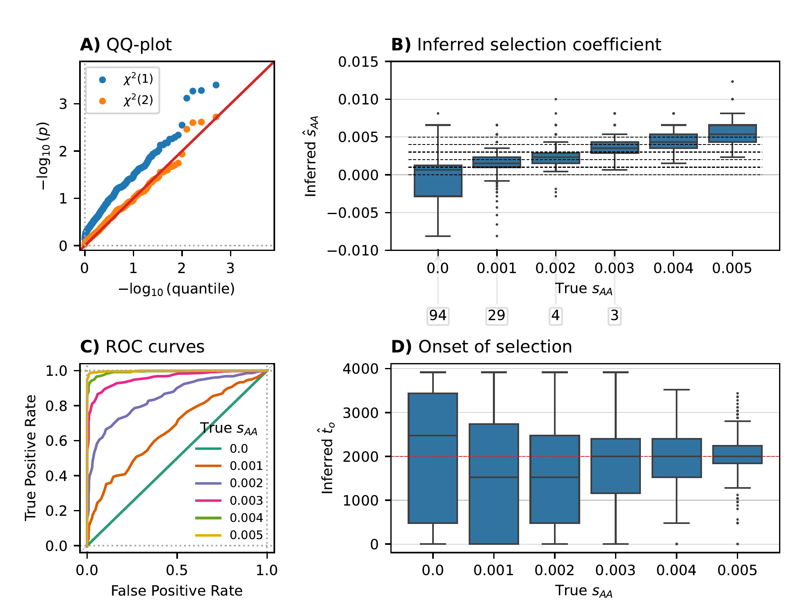

## Figure S8: Estimate onset of selection

The scripts in this directory simulate and analyse data in the scenario where the onset of selection is unknown and is to be estimated, see Section S2.5 for details. These scripts generate Figure S8, which summarizes the results of this analysis. The scripts are set up to run in an HPC environment with the SLURM queueing manager. Replacing
```shell
THE_EXECUTOR = execution_engine.FileExecutor ("...", append=False)
```
with
```shell
THE_EXECUTOR = execution_engine.SubprocessExecutor()
```
in the beginning of the scripts `step1_simulate_onset.py` and `step2_analyze_diplo_onset.py` will run the analysis on the command line. In addition to `diplo-locus` installed, the python module `seaborn>=0.13.2` is required.

To run the scripts, first navigate to the sub-directory:
```shell
# navigate to the directory
cd supp_figS8_onset/
```

#### Simulation

To set up the scripts for the simulations to be submitted to the cluster, run:
```shell
python step1_simulate_onset.py
```
Note that this will exit with a failed assertion. To prepare submitting the scripts to the cluster, run:
```shell
python slurmify.py SLURM_SIMULATE.txt sim_onset
```
followed by:
```shell
sh submit_sim_onset.sh
```
to submit the scripts to the cluster. After all jobs are finished on the cluster, run:
```shell
python step1_simulate_onset.py
```
again to finalize and reformat the simulated data.

#### Analysis

To analyze the simulated data, we first set up scripts for the jobs to run on the cluster. To this end, run:
```shell
python step2_analyze_diplo_onset.py
```
Then, prepare the job submission with:
```shell
python slurmify.py SLURM_ANALYZE.txt analysis_onset
```
and run:
```shell
sh submit_analysis_onset.sh
```
to submit the jobs for the analysis to the cluster. Once all jobs are finished, the analysis is complete, and the next steps can be performed.

#### Collect results

To collect the results from the analysis, run:
```shell
python step3_collect_results.py
```

#### Plot results

To finally generate Figure S8, summarizing the results of the analsis, run:
```shell
python step4_plot_results.py
```
This should yield the file `QQ_ROC_BOX_onset.pdf`, which is included as Figure S8 in the supplement of the paper:

